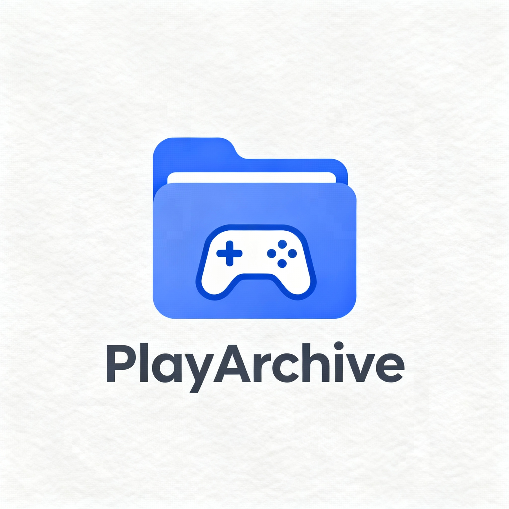

# PlayArchive

  

PlayArchive é um projeto pessoal e uma aplicação web pensada para quem quer organizar, explorar e compartilhar sua biblioteca pessoal de jogos.

## Sobre o Projeto

O objetivo do PlayArchive é oferecer uma plataforma intuitiva e moderna para gamers registrarem os jogos já jogados, acompanhar suas coleções e descobrir informações detalhadas de cada título. Em breve, será possível sincronizar com APIs populares para automação, explorar novas recomendações e compartilhar sua biblioteca com amigos e comunidades.

## Funcionalidades

- Cadastro e login de usuários
- Adicionar/remover jogos à biblioteca pessoal
- Visualização em cards organizados por plataforma, gênero, status (jogado, jogando, wishlist)
- Busca rápida por títulos
- Página de detalhes do jogo com capa, notas, descrição e status
- Visual minimalista, responsivo para desktop e mobile
- Integração planejada com APIs de jogos para atualização automática de dados e informações extras
- Futuramente: recomendações personalizadas, compartilhamento de biblioteca, registro de progresso/emblemas

## Tecnologias

- **Frontend:** Next.js, Typescript, React Query, Vitest, React Testing Library
- **Backend:** Python (FastAPI)
- **Banco de dados:** PostgreSQL
- **Autenticação:** Supabase 
- **Cache:** Redis (para otimização de consultas externas)
- **Estado:** Zustand, Context API
- **Hospedagem:** Docker, pronto para deploy em serviços como Vercel/Render
- **Tradução:** next-intl, Google Translate API
- **Design:** Figma, Banani (protótipos e identidade visual pensados para experiência limpa e moderna)

## Status

🚧 Em desenvolvimento!  
Em breve, a PlayArchive estará disponível públicamente. Fique de olho nas atualizações e sinta-se livre para contribuir ou acompanhar o projeto.

## Como contribuir

1. Faça um fork do repositório.
2. Abra um Pull Request com sua sugestão/correção.
3. Para ideias, melhorias ou bugs, utilize as Issues.

---

**Contatos**

- Autor: Davi Lopes Ribeiro
- LinkedIn: https://www.linkedin.com/in/davilopesribeiro/
- E-mail: engcomp.daviribeiro@gmail.com
